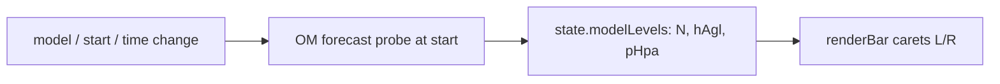

# Starthöhen: model-level carets

## Locked decisions

1. **Reference:** Place ticks in the current Starthöhen-Referenz — AGL as `h_agl`, AMSL as `h_agl+startElevation` (skip until elevation known if AMSL).
2. **Which levels (C):** All model levels with `0 < h_agl ≤ barMax` — **no decimation**. Dense carets are OK.
3. **Labels (D):** Carets always visible; **altitude / pressure text only on hover** (`data-tip` CSS tooltip). No persistent altitude labels on the strip.
4. **Visual:**
   - **Left outside** the blue strip: small **carets** at model **geometric** heights (hover → altitude).
   - **Right outside** the strip: sparse **isobar carets** from **api.open-meteo.com** `geopotential_height_{hPa}hPa` (not private hosts; not model `pressure_level*`).
5. **Model:** Currently selected model; refresh on model / start / time.
6. **AMSL terrain band:** Compress NN→Grund to ~10% of usable scale (`BAR_TERRAIN_FRAC`) so orography does not dominate the bar.

## Data flow

- Probe vars: for `l = 1..nLevels` (or bottom-up until above `barMax` + margin): `height_agl_level{l}`, `pressure_level{l}` (same Open-Meteo surface already used in [`src/windfield.js`](src/windfield.js)).
- Cache on `state` (e.g. `modelLevelProbe: { modelKey, lat, lon, timeKey, levels: [{ n, hAgl, pHpa }] }`); ignore stale responses.
- Reuse `modelForecastUrl` / grid point like the existing elevation/wind probes in [`src/app.js`](src/app.js) (~2716+).

## UI changes ([`src/app.js`](src/app.js) `renderBar`, [`css/style.css`](css/style.css))

- In `renderBar()`, after scale ticks, before/around start markers:
  - Left: `.bar-model-caret.bar-model-caret--h` at `posPct(displayMeters)` with `title` = altitude string.
  - Right: `.bar-model-caret.bar-model-caret--p` at same `bottom` % with `title` = pressure string.
- Draw **every** in-range level (no pixel-gap filter). Keep caret geometry tiny so dense Global levels stay readable as a texture of marks.
- Carets are clickable (`data-m` = snapped geometric meters in current ref); wire click like existing bar click → `setActiveHeight` / add height.
- Do not steal clicks from start-height label rows / edit / remove; z-index and hit targets kept narrow (caret hit-area ~taller than the glyph if needed for clickability).
- No separate toggle (always on when probe data exists).

## Edge cases

- No start elevation yet + AMSL mode: show nothing until elevation known.
- Missing `pressure_level*` for a level: draw height caret only.
- Model/bbox change: clear cache and re-probe.
- ft mode: hover altitude via existing `fmtHeight` / display helpers; pressure stays hPa.

## Out of scope

- Changing trajectory compute / WindField level selection logic.
- Persistent on-strip altitude/pressure labels (hover only).
- Making carets draggable.

## Implementation todos

1. Add OM start-point probe for `height_agl_level*` + `pressure_level*`; cache on state; refresh on model/start/time
2. `renderBar`: left height carets + right pressure carets for all in-view levels; hover titles only
3. Click caret snaps/adds start height via existing `heightColors` path
4. CSS for muted tiny left/right carets without colliding with start markers
